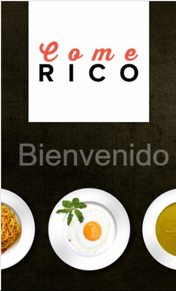

# Come rico
La aplicación Come rico esta diseñada para encontrar restaurantes de forma rápida y amigable de acuerdo con los diferentes gustos. Se filtra por tipo de comida criolla, pastas, pizzas, sushi, vegana y mariscos. 

## Desarollado para

[Laboratoria](http://www.laboratoria.la/)

# Reto 2: Aplicación Come Rico

## Objetivo

* Esta aplicación ha sido diseñada con el principal objetivo de encontrar sitios culinarios de forma rápida y amigable de acuerdo con los diferentes gustos, de acuerdo a un select.
* Esta web-app, puede filtrar los diversos restaurantes de acuerdo al tipo de orientación gastronómica por lo que se implementó un array, que permite almacenar los datos, llamado data.js

## Desarollo de trabajo
* Esta aplicación consta de 2 vistas; la primera muestra la vista splash, la segunda muestra el desarrollo de la web-app (listado de tipo de comida, así como los diferentes restaurantes según la elección realizada, mencionaremos también que con un modal se puede visualizar la información de cada uno de los restaurantes según elección.

## Producto final

   

## Paginas consultadas

* https://www.w3schools.com/

* https://stackoverflow.com/

* https://codigofacilito.com/

## Herramientas utilizadas

* HTML5

* jQuery

* Bootstrap

* Materialize
 
